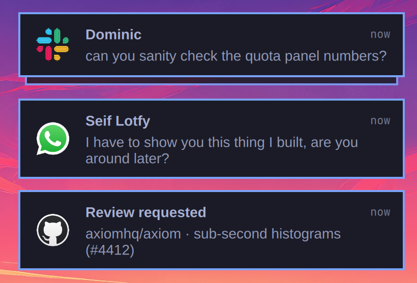
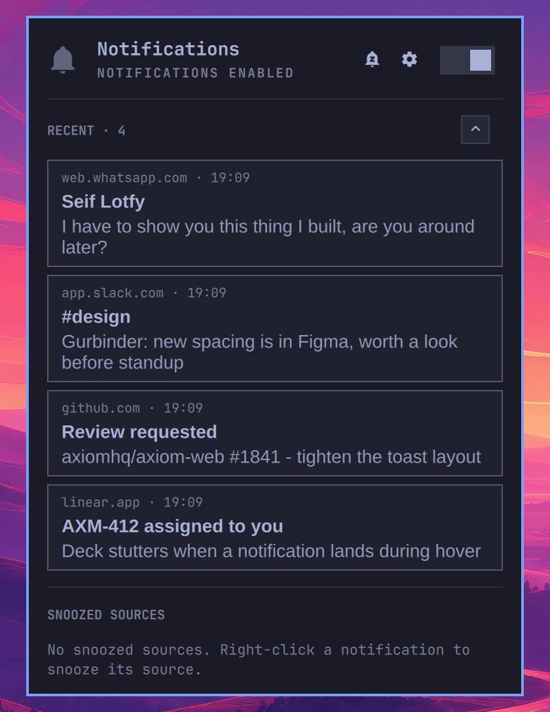
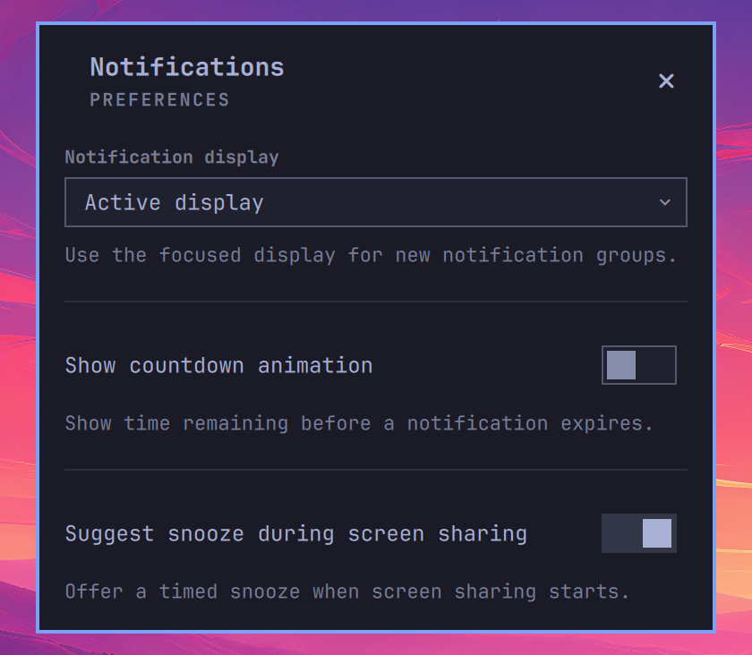

<!--
 ▄█████▄    ▄███████████▄   ▄███████   ▄███████▄  ▄███████    ▄█████▄   ▄████████  ▄███████▄
███   ███  ███   ███   ███  ███   ███  ███   ███  ███   ███  ███   ███  ███   ███  ███   ███
███   ███  ███   ███   ███  ███   ███  ███   ███  ███   ███  ███        ███   ███  ███   ███
███   ███  ███   ███   ███  ███▄▄▄███  ███▄▄▄███  ███▄▄▄███  ███ ▄▄▄▄▄  ███▄▄▄     ███▄▄▄██▀
███   ███  ███   ███   ███  ███▀▀▀███  ███▀▀▀▀▀▀  ███▀▀▀███  ███ ▀▀███  ███▀▀▀     ███▀▀▀██▄
███   ███  ███   ███   ███  ███   ███  ███        ███   ███  ███   ███  ███   ███  ███   ███
███   ███  ███   ███   ███  ███   ███  ███        ███   ███  ███   ███  ███   ███  ███   ███
 ▀█████▀    ▀█   ███   █▀   ███   █▀    ▀█        ███   █▀    ▀█████▀    ▀███████   ███   █▀
-->

A notification daemon for [Omarchy](https://omarchy.org) with grouped
notifications, inline actions and screen-sharing detection. Replaces the built-in
notification service and follows your Omarchy theme.



## Features

**Screen-sharing detection.** When you share a screen, window or area through
the Hyprland portal, Omapager offers to snooze notifications for 30 minutes,
1 hour or 4 hours. Nothing is muted until you choose. You can disable these
suggestions in preferences.

**Grouped notifications.** Messages from the same source stack together. Hover
to expand the group and read or act on each notification.


[Watch the demo video](assets/deck.mp4).

**Theme support.** Follows your Omarchy theme.

**Code, link and phone actions.** Copy verification codes and phone numbers, or
open links, directly from a notification. Multiple codes get separate buttons.


**Per-notification actions.** Use app-provided actions such as Mark as read
without opening the app.

**Inline replies.** Reply to supported KDE Connect messages without leaving the
notification.


**Window focus.** Click a notification to focus its app or browser window.
Web notifications open their source URL when no matching window is available.

**Snooze and Do Not Disturb.** Right-click a notification to snooze its source.
Use the panel to snooze everything or toggle Do Not Disturb.

**Verification-code exception.** Let login codes through while notifications
are snoozed or silenced. Turn this off with the key button in the panel.

**Held notifications.** Read messages received while a source was snoozed in
the panel's Held Back section.

**Recent notifications.** Review recently dismissed or expired notifications
by expanding Recent in the panel. The list clears when the shell restarts.



**Source icons.** Use local icons or fetch missing website icons automatically.
Set `fetchRemoteIcons` to `false` in the config to disable fetching.

## Install

Check the [requirements](#requirements), choose one installation method in
step 1, then enable Omapager in step 2.

### 1. Install

#### Releases via the marketplace

Find Omapager in the [Omarchy Plugin Marketplace](https://omarchyplugins.com/)
and run its install command:

```bash
omarchy plugin add https://github.com/njpatel/omapager.git
```

Until the new stable release is approved, the marketplace installs Git HEAD.

#### Edge via Git

Clone `main` for the latest changes between releases:

```bash
git clone --branch main https://github.com/njpatel/omapager.git \
  ~/.config/omarchy/plugins/njpatel.omapager
```

### 2. Enable Omapager

After either installation method, disable the built-in notification service and
enable Omapager. Only one notification daemon can run at a time.

```bash
omarchy-shell shell rescanPlugins
omarchy plugin disable omarchy.notifications
omarchy plugin enable njpatel.omapager --section center --after omarchy.indicators
omarchy restart shell
```

### Updates

Use the marketplace for release updates. For an edge checkout:

```bash
git -C ~/.config/omarchy/plugins/njpatel.omapager pull --ff-only
omarchy restart shell
```

[Release notes](https://github.com/njpatel/omapager/releases) describe each update.
Do not use `omarchy refresh shell`, which resets your shell configuration.

### Remove Omapager

```bash
omarchy plugin disable njpatel.omapager
omarchy plugin remove njpatel.omapager
omarchy plugin enable omarchy.notifications
omarchy restart shell
```

Removal keeps notification history, icon cache and other state in
`~/.local/state/omarchy/omapager/`. Delete that directory separately if you also
want to remove the stored data.

## Settings

Open the panel and click the settings cog to choose a notification display,
toggle countdown animation or control screen-sharing snooze suggestions.



Changes save to the `njpatel.omapager` bar-widget entry in
`~/.config/omarchy/shell.json`. You can edit the other options there too.
`edgeSpacing`, `fetchRemoteIcons` and `requireSandbox` are config-only. Defaults
below apply to new configurations, not choices you have already saved.

### Omapager options

| Option | Default | Purpose |
| --- | --- | --- |
| `stacking` | `source` | `source` gives each sender a deck. `all` uses one deck. |
| `displayMode` | `active` | `active` follows focus for new decks. `specific` uses `displayName`. `all` mirrors notifications. Visible decks stay put in active mode. |
| `displayName` | empty | Output for specific mode, such as `DP-1`. Omapager keeps the selection while disconnected and falls back to a connected display. |
| `edgeSpacing` | `12` | Gap from the bar and screen edges, in logical pixels from 0 to 64. Config-only. |
| `showCountdown` | `false` | Show the time-remaining animation. Turning it off does not change expiry. |
| `offerSnoozeWhenSharing` | `true` | Suggest a timed snooze when portal sharing starts. Never mute automatically. |
| `fontScale` | `100` | Notification text size as a percentage, from 75 to 200. Does not resize bar or panel text. |
| `actionsAlign` | `right` | Align action buttons to the `right` or `left`. |
| `hideSettingsAction` | `true` | Hide the browser's repeated Settings action. |
| `snoozeDurations` | `30, 60, 240, tomorrow` | Offer `15`, `30`, `60`, `120`, `240` or `480` minutes, or `tomorrow`. An empty selection uses the defaults. |
| `wakeHour` | `8` | Wake hour for `tomorrow`, from 0 to 23. Currently `0` falls back to `8`. |
| `smartRaise` | `true` | Match notification websites against browser window titles when focusing a window. |
| `alwaysShow` | `false` | Keep the bar indicator visible when nothing is held back. |
| `codesBypassQuiet` | `true` | Let verification codes through snooze and Do Not Disturb. |
| `timeFormat` | `system` | Use the `LC_TIME` locale, or choose `24h` or `12h`. |
| `sourceLimit` | `8` | Number of quietened sources listed in the panel, from 2 to 20. |
| `heldPerSource` | `10` | Held notifications shown per source, from 3 to 25. |
| `recentCount` | `5` | Recent notifications shown in the panel, from 1 to 20. Clears on shell restart. |
| `fetchRemoteIcons` | `true` | Fetch missing website icons. Turning it off keeps local and validated cached icons. Requires Pillow. Config-only. |
| `requireSandbox` | `false` | Require Bubblewrap instead of allowing helpers to run directly when it is unavailable. Config-only. |
| `allowDefaultActionOnCardClick` | `false` | Allow the app's default action on a card click. Explicit action buttons remain available when off. |
| `historyHours` | `24` | Keep disk history for `1`, `24` or `168` hours, with a 100-entry cap. `0` disables it. |
| `clipboardTimeout` | `60` | Clear copied codes after `30`, `60` or `90` seconds, unless the clipboard has changed. |

Add options to the existing widget entry. This example is not a complete
`shell.json` file:

```json
{
  "id": "njpatel.omapager",
  "edgeSpacing": 12,
  "showCountdown": false,
  "fontScale": 100,
  "historyHours": 24
}
```

### Appearance inherited from Omarchy

Theme overrides belong in `~/.config/omarchy/shell.toml`, not the plugin's
`shell.json` entry. Your overrides take precedence over the active theme and
apply to other Omarchy components that use the same settings.

| Appearance | Omarchy setting |
| --- | --- |
| Notification colours | `[notifications]` background, text, border and countdown colours |
| Card border width | `[notifications] border-width`, including per-side overrides. The fallback is 2 logical pixels at the default scale, as in stock notifications. |
| Panel colours and border | `[popups]` |
| Corner rounding | Hyprland's `decoration:rounding` |
| Text sizes | `[font]`. Titles and message text use Liberation Sans. Controls use the shared UI font. |
| Button and switch states | `[controls]` |
| Internal spacing and padding | `[spacing]` |

For example, set the notification border width in `~/.config/omarchy/shell.toml`:

```toml
[notifications]
border-width = 2
```

The `edgeSpacing` option is separate from Omarchy's outer gaps. It keeps the
configured distance regardless of the theme's spacing scale or Hyprland's
`general:gaps_out`. At 2x display scaling, 12 logical pixels occupy 24 physical
pixels.

### Sharing detection

Omapager detects screen, window and area sharing through the Hyprland portal.
It uses stream metadata, not your screen content. Click the sharing indicator
to snooze for 30 minutes, 1 hour or 4 hours, or choose Not now.

An existing global snooze or Do Not Disturb suppresses the offer. Each sharing
period gets one offer, even with multiple streams. A chosen snooze lasts for its
selected duration, regardless of when sharing ends. Critical alerts and the
configured verification-code exception still apply.

Portal-based recording can trigger detection. Screenshots, direct VNC capture and
apps that bypass the portal do not. Omapager tracks up to 64 video-source nodes.
Restarting the shell during a share can show the offer again. Disable suggestions
in preferences or set `offerSnoozeWhenSharing` to `false`.

## The bar

The indicator appears while notifications are held back or a sharing offer is
waiting. Hover the centre of the bar to reveal it at other times.

| Indicator | Meaning |
| --- | --- |
| Crossed-out bell in the urgent colour | Do Not Disturb |
| Sleeping bell in the accent colour | A source or all notifications are snoozed |
| Sharing icon in the accent colour | Sharing detected. Click to choose a snooze. |
| Dimmed bell | Nothing held back |

Left-click the bell to silence or resume notifications. Right-click to open the
panel for Recent, held messages and snooze controls.

## Keybindings

Omarchy's existing comma-key shortcuts work without configuration:

| | |
| --- | --- |
| `SUPER` `,` | dismiss the newest notification |
| `SUPER` `SHIFT` `,` | dismiss all of them |
| `SUPER` `CTRL` `,` | toggle silencing |
| `SUPER` `ALT` `,` | invoke the newest one, as clicking it would |
| `SUPER` `SHIFT` `ALT` `,` | put the last few back on screen |

### Optional bindings

Check for conflicts with `omarchy menu keybindings --print` before adding these
to `~/.config/hypr/bindings.lua`. Use `hl.unbind` to remove a conflicting binding.

```lua
-- Copy the newest code and dismiss its notification.
o.bind("SUPER + ALT + C", "Copy code from newest notification",
       "omarchy-shell omapager offer code")

-- Snooze all sources for an hour.
o.bind("SUPER + CTRL + ALT + comma", "Snooze all notifications for an hour",
       "omarchy-shell omapager snoozeAll 60")

-- Toggle the notification panel.
o.bind("SUPER + CTRL + SHIFT + comma", "Notification options",
       "omarchy-shell omapager.panel toggle")
```

## Scripting

```
omarchy-shell omapager count            how many are on screen
omarchy-shell omapager clear            dismiss them
omarchy-shell omapager dnd              toggle Do Not Disturb
omarchy-shell omapager expand           open the deck, as hovering would
omarchy-shell omapager offer code       take the front card's offer (code|link|phone)
omarchy-shell omapager act reply        invoke one of the sender's actions
omarchy-shell omapager reply "text"     answer the front card ("" opens the field)
omarchy-shell omapager snooze 60        quieten the front card's source, in minutes
omarchy-shell omapager snoozeAll 60     quieten everything for 60 minutes, or wake it
omarchy-shell omapager codes off        stop letting verification codes through
omarchy-shell omapager unsnooze ""      wake everything ("" for all, or a source key)
omarchy-shell omapager snoozes          what is snoozed, and until when
omarchy-shell omapager stack source     switch stacking mode
omarchy-shell omapager align right      switch which end the buttons sit at
omarchy-shell omapager probe            show runtime configuration and helper status as JSON

omarchy-shell omapager.panel toggle     the panel
omarchy-shell omapager.panel expand x   open a source's held list, as clicking it would
omarchy-shell omapager.panel openSettings  notification preferences
```

## Demo

```bash
bin/omapager-demo                       # the everyday scenes
bin/omapager-demo --scene interactive   # codes, links, and the sender's buttons
bin/omapager-demo --scene routing       # where a click sends you, per source
bin/omapager-demo --scene reply --keep --timeout 30000  # local inline-reply demo
bin/omapager-demo --replay 40           # your own notifications, re-sent
bin/omapager-demo --list
```

The demos use the original named conversations and source icons. Add `--keep`
to leave existing notifications on screen.

The routing scene lists the window or URL each notification should open. The
reply scene lets you type and send a reply without contacting a phone. It saves
the latest reply in `~/.local/state/omarchy/omapager/reply-demo/reply.json`.
Each run creates a new demo session, which expires after 30 minutes.

## Security

### Automatic website icons

Omapager checks local icons and its cache before fetching from a website.
Website-icon fetching is on by default. Set `"fetchRemoteIcons": false` in the
widget's `shell.json` entry to stop requests and cancel the active lookup.
Local and validated cached icons still work. Saved opt-outs survive upgrades.

Requests expose your IP and request time to the source website and its icon
hosts. They contain no notification text, verification codes, browser cookies or
authentication headers. Omapager does not use a third-party favicon service or
guess parent domains.

These protections apply with or without Bubblewrap:

- HTTPS on port 443 with TLS 1.2 or newer. Omapager rejects URL credentials,
  IP literals and local or private destinations.
- Every DNS answer must be public. Connections use those checked addresses,
  with certificate validation for the original hostname.
- Redirects and icon URLs receive the same checks. Proxy environment variables
  cannot bypass them.
- Downloads have redirect, byte and time limits. Pillow validates image formats
  and dimensions, then re-encodes icons as small PNGs. Remote SVGs are rejected.

Keep Python, Pillow and the system libraries updated. These checks do not protect
against another process running as your user and modifying the local cache.

### Optional helper sandbox

Storage, icon and KDE Connect helpers use Bubblewrap when its startup check
succeeds. Otherwise they run directly as your user, with your account's normal
filesystem and network access. Input validation and resource limits still apply.

Set `"requireSandbox": true` in the widget's `shell.json` entry to block helpers
when sandboxing is unavailable. This affects persistence, icon lookup and phone
replies. The saved policy applies before startup helpers run. A failed helper
is never retried without its sandbox.

Sandboxed helpers receive access to the files they need. Remote icons still need
network access, and KDE Connect receives the session bus without destination
filtering. Bubblewrap does not isolate the QML shell itself.

Run `omarchy-shell omapager probe` to check whether helpers use `sandboxed`,
`direct` or `blocked` mode. See [the security architecture](docs/SECURITY_ARCHITECTURE.md)
for the exact limits and access rules.

### Stored notifications and clipboard

Disk history defaults to 24 hours and 100 entries. Omapager redacts detected
verification-code notifications before saving them, but detection cannot identify
every secret. Copied codes clear after the configured timeout only if the
clipboard still contains the same code.

State lives in `~/.local/state/omarchy/omapager/`. See [settings](#settings) for
retention and clipboard options, and [SECURITY.md](SECURITY.md) to report a
vulnerability.

## Requirements

- Omarchy with Quickshell 0.3.x and Hyprland.
- Python 3 for the helpers.
- Pillow, packaged as `python-pillow`, for remote website icons. Local theme
  icons work without it.
- Bubblewrap, packaged as `bubblewrap`, is optional unless `requireSandbox` is on.
- `wl-clipboard` is recommended for sensitive clipboard handling.
- KDE Connect and its phone app are required for phone notifications and replies.

See [Security](#security) for icon-fetching and sandbox behaviour.

## Contributing

See [how we review contributions](docs/DEVELOPING.md#how-we-review-contributions)
and the [development guide](docs/DEVELOPING.md) for working on omapager.

## Licence

Apache-2.0.

## Compatibility additions in this fork

This branch preserves an existing Omarchy desktop configuration:

- Validated `omarchy-exec-argv` click hints run as an argv vector, never
  interpolated into a shell command, and survive Omapager history restoration.
- Critical popups expire after 15–30 seconds. Critical urgency by itself does
  not bypass DND: only `omarchy-action` feedback and critical `notify-send`
  alerts do. Omapager's configurable verification-code exception remains.
- Up to 100 expired default actions stay in memory for the notification-center
  plugin through `invokeArchivedDefault(key)`. Callbacks are never serialized.
- Replacement metadata identifies the service as replacing
  `omarchy.notifications`; the original and any other replacement must be disabled.
- The store's persistence allowlist keeps `execArgv` only when it is a JSON
  string array whose executable does not start with `-`, and never on redacted
  verification rows. Image paths remain dropped, as upstream intends.
- Card clicks without an argv hint follow upstream's strict default; this
  desktop sets `allowDefaultActionOnCardClick: true` on the bar widget.

The existing notification-center plugin needs its input directories pointed
at Omapager's `live` and `history` directories. Its ingestion adapter must use
the JSON `key` for deduplication, convert `ts` seconds to milliseconds, and
preserve `rawBody` for browser-origin routing. This deployment config is
maintained outside Omapager.

Validation: `node compat.test.cjs`, `qmllint Service.qml`, and a live synthetic
notification verifying click execution and a single correctly timestamped
entry in the existing notification center.
